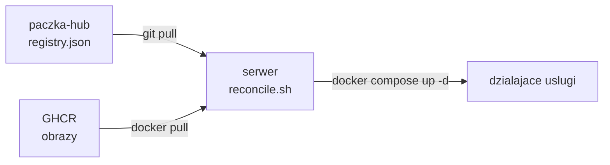

# paczka-hub

Warstwa kontrolna infrastruktury Paczki. To repozytorium jest jedynym źródłem prawdy o tym,
co i w jakiej wersji ma działać na serwerze. Nie zawiera kodu usług - te żyją w osobnych
repozytoriach. Tutaj są: deklaracja stanu (registry), pliki serwera, sekrety (zaszyfrowane),
wspólna konfiguracja i dokumentacja.

Pełny opis architektury i plan wdrożenia: [docs/plan-wdrozenia.md](docs/plan-wdrozenia.md).

## Spis treści

- [Wymagania lokalne (dla współpracujących)](#wymagania-lokalne-dla-współpracujących)
- [Jak to działa w skrócie](#jak-to-działa-w-skrócie)
- [Struktura repozytorium](#struktura-repozytorium)
- [registry.json - format](#registryjson---format)
- [Najczęstsze zadania](#najczęstsze-zadania)
  - [Wdrożyć nową wersję usługi (produkcja)](#wdrożyć-nową-wersję-usługi-produkcja)  
  ~~- [Wdrożyć na staging (bez admina)](#wdrożyć-na-staging-bez-admina)~~
  - [Dodać lub zmienić sekret](#dodać-lub-zmienić-sekret)
  - [Dodać nową usługę](#dodać-nową-usługę)
  - [Rollback](#rollback)
  - [Wyłączyć usługę](#wyłączyć-usługę)
- [Uprawnienia](#uprawnienia)
- [Serwer i operacje](#serwer-i-operacje)
- [Dokumentacja](#dokumentacja)

## Wymagania lokalne (dla współpracujących)

Do pracy z tym repo wystarczy:

- `git`,
- `sops` i `age` - do sekretów,
- `docker` i `docker compose` - do lokalnego uruchomienia,
- `jq` - pomocniczo przy registry.

Admini dodatkowo trzymają swój prywatny klucz age (do deszyfracji sekretów). Developerzy klucza
prywatnego nie potrzebują - szyfrowanie działa na kluczach publicznych z `.sops.yaml`.

## Jak to działa w skrócie

Model jest pull-based. Serwer sam pobiera to repozytorium i doprowadza rzeczywistość do stanu
opisanego w `registry.json`. Nikt nie wdraża ręcznie na serwer.



Deploy to zmiana w `registry.json` (podbicie wersji), zatwierdzona przez admina w PR.  
Serwer w pętli co 5 minut (plus szybka ścieżka przez webhook, przy mergu) wykrywa różnicę i dogania stan.

Jedyne dwa manualne ruchy:   
1. merge w repo usługi 
2. podbicie wersji w hubie.  

## Struktura repozytorium

```text
paczka-hub/
  registry.json            deklaracja stanu produkcji (co i w jakiej wersji)
  registry.schema.json     schemat walidujacy oba pliki registry

  server/                  pliki serwera (STALE, czesc systemu)
    docker-compose.yml     zlozenie uslug na hoscie
    reconcile.sh           petla doprowadzajaca stan do registry
    dispatcher/            odbiornik webhooka (reconcile + powiadomienia)
    bootstrap.sh           przygotowanie swiezego serwera

  config/                  wartosci jawne, wspolne dla uslug
    shared.env             np. TZ, LOG_LEVEL, DOMAIN_URL

  secrets/                 sekrety zaszyfrowane przez SOPS (patrz secrets/README.md)
    <usluga>.<srodowisko>.sops.yaml

  .sops.yaml               reguly szyfrowania i lista odbiorcow (klucze publiczne)

  docs/                    dokumentacja (zrodlo; HTML/PDF sa generowane, nie commitowane)
    plan-wdrozenia.md
    NOWE-REPO.md

  tooling/migration/       skrypty JEDNORAZOWE do migracji, kasowane w Fazie 8

  .github/
    CODEOWNERS             kto zatwierdza ktore sciezki
    workflows/             hub-CI (walidacja registry, obrazu, compose)
```

## registry.json - format

~~`registry.json` opisuje pożądany stan produkcji. `registry.staging.json` ma ten sam kształt,
ale dotyczy stagingu.~~

```json
{
  "services": {
    "bot": {
      "image": "ghcr.io/paczkainfapg-code/paczka-bot",
      "version": "v1.4.2",
      "enabled": true,
      "stateful": false
    }
  }
}
```

Pola:

- `image` - obraz w GHCR bez tagu (wymagane).
- `version` - niemutowalny tag `vX.Y.Z` (wymagane). To jedyna dźwignia "która wersja".
- `enabled` - czy usługa ma działać (domyślnie `true`). `false` to jawne wyłączenie.
- `stateful` - czy przed zmianą wersji zrobić snapshot wolumenu (domyślnie `false`).

Schemat w `registry.schema.json` jest egzekwowany przez hub-CI - niepoprawny wpis nie przejdzie.

## Najczęstsze zadania

### Wdrożyć nową wersję usługi (produkcja)

1. Upewnij się, że obraz `:vX.Y.Z` istnieje w GHCR (buduje go repo usługi przy wydaniu).
2. Otwórz PR zmieniający `version` danej usługi w `registry.json`.
3. hub-CI sprawdzi schemat, istnienie obrazu i poprawność compose.
4. Admin zatwierdza i merguje (to jedyna brama wydania).
5. Serwer dogania stan przy najbliższym tiku lub po webhooku.

~~### Wdrożyć na staging (bez admina)~~

~~1. Otwórz PR zmieniający wpis w `registry.staging.json` i ustaw `enabled: true`.
2. Zmerguj samodzielnie (staging nie wymaga zatwierdzenia admina).
3. Po testach wróć wpisem na `enabled: false`, żeby zwolnić zasoby.~~

### Dodać lub zmienić sekret

Patrz [secrets/README.md](secrets/README.md). W skrócie: nowy sekret możesz zaszyfrować kluczami
publicznymi z `.sops.yaml` bez dostępu do istniejących sekretów, a PR do `secrets/` zatwierdza
admin.

### Dodać nową usługę

Patrz [docs/NOWE-REPO.md](docs/NOWE-REPO.md).

### Rollback

Zrewertuj PR z podbiciem wersji i zmerguj. Serwer cofnie obraz do poprzedniej wersji. Dla usług
z `stateful: true` snapshot wolumenu z momentu podbicia pozwala też cofnąć dane.

### Wyłączyć usługę

Ustaw `enabled: false` w odpowiednim registry i zmerguj. Reconcile jawnie zatrzyma usługę.

## Uprawnienia

Uprawnienia nadajemy przez zespoły, nie osoby.

- `paczka-admins` - pełna kontrola nad hubem i produkcją.
- `paczka-devs` - piszą kod usług, samodzielnie wdrażają na staging.

Wrażliwe ścieżki (`registry.json`, `server/`, `secrets/`, `.sops.yaml`) są pod `CODEOWNERS`,
więc PR ich dotykający wymaga zatwierdzenia admina. ~~`registry.staging.json` celowo nie jest pod
CODEOWNERS, więc developer merguje staging sam.~~

Uwaga o dostępie: prawo merge do gałęzi `main` w tym repo jest równoważne dostępowi root na
serwerze, bo serwer pobiera hub i z niego wykonuje reconcile. Ruleset na `main` to de facto
kontrola dostępu do produkcji.

## Serwer i operacje

- Reconcile uruchamia timer systemd co 5 minut (kręgosłup) oraz webhook (szybka ścieżka).
- Blokada plikowa (flock) zapobiega nałożeniu dwóch przebiegów.
- Każdy przebieg raportuje wynik na Discord, także przy błędzie.
- Webhook trafia na dispatcher w `server/dispatcher/`, wystawiony przez Cloudflare Tunnel
  (bez otwartych portów). Dispatcher weryfikuje podpis (fail-closed) i rozgałęzia: push na
  `main` huba budzi reconcile, zdarzenia PR idą jako powiadomienia na Discord.

Szczegóły w [server/README.md](server/README.md).

## Dokumentacja

Źródłem jest `docs/plan-wdrozenia.md`. Wersje HTML i PDF są artefaktami generowanymi ze źródła
i nie są commitowane do repo. Jeśli chcesz je komuś pokazać bez klonowania, dołącz je do
GitHub Release.
